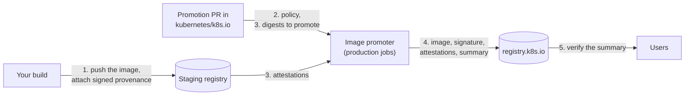
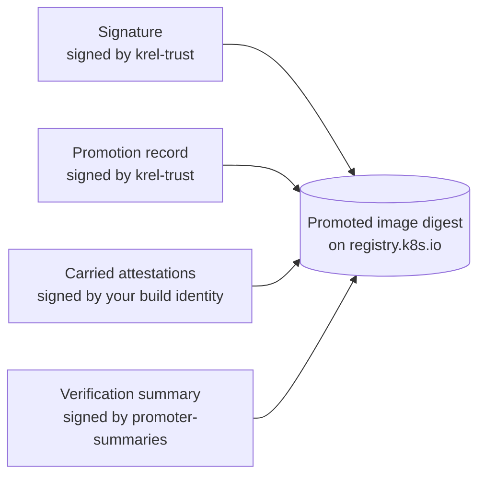
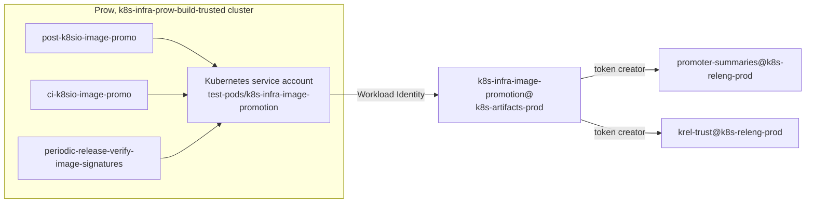

# Verification summaries for promoted images

The image promoter publishes a signed [SLSA verification summary][slsa-vsa]
(VSA) for every image it promotes to `registry.k8s.io`. The summary says that
the image was promoted from a reviewed promoter manifest and, when its project
has a provenance policy, that the image's build attestations passed that
policy, and at which SLSA build level. Users verify that one summary instead of
the build attestations of every project.

This page explains how it works, how a project gets summaries with a build
level for its images and how to verify them. The reference for every option is
[image-promotion.md](image-promotion.md).

- [How it works](#how-it-works)
- [What a promoted image carries](#what-a-promoted-image-carries)
- [Getting summaries with a build level](#getting-summaries-with-a-build-level)
- [Verifying a summary](#verifying-a-summary)
- [Signing identities](#signing-identities)

## How it works



1. Your build pushes the image to staging and attaches signed attestations,
   at least SLSA build provenance, as OCI referrers of the image digest.
2. The promoter manifest of your project in [kubernetes/k8s.io][k8sio-manifests]
   declares a provenance policy: who may sign the attestations, which builders
   and source repositories are trusted, and at which SLSA build level.
3. A reviewed PR adds the digest to `images.yaml`. The production promotion
   jobs evaluate the staging attestations of the digest against the policy.
4. The promoter copies the image by digest, signs it, records the promotion,
   copies the attestations the policy accepted, and writes the summary with
   the result.
5. Users verify the summary on `registry.k8s.io`, bound to the promoter's
   verifier ID and signing identity.

## What a promoted image carries



They are stored on the canonical registry and served through
`registry.k8s.io`: the signature as a cosign `.sig` tag, the others as sigstore
bundles attached as OCI referrers of the digest.

| What | Predicate type | Signed by | Written for |
| ---- | -------------- | --------- | ----------- |
| Signature | none, cosign `sha256-<digest>.sig` tag | `krel-trust@k8s-releng-prod.iam.gserviceaccount.com` | images promoted with a tag, and the platform manifests of such an index |
| [Promotion record](promotion-predicate.md) | `https://k8s.io/promo-tools/promotion/v1` | `krel-trust@k8s-releng-prod.iam.gserviceaccount.com` | every digest the promoter manifest lists, not the platform manifests of an index |
| Carried attestations | as attested in staging | your build identity, unchanged | digests with a provenance policy, the attestations it accepted |
| Verification summary | `https://slsa.dev/verification_summary/v1` | `promoter-summaries@k8s-releng-prod.iam.gserviceaccount.com` | every promoted digest, platform manifests included |

The summary records:

- `verifier.id`: `https://k8s.io/promo-tools/verifier/v1`, which identifies the
  promoter;
- `verificationResult`: `PASSED`, or `FAILED` when the policy is not satisfied
  in `warn` mode;
- `verifiedLevels`: the SLSA build level the policy verified, from
  `SLSA_BUILD_LEVEL_1` to `SLSA_BUILD_LEVEL_3`, or
  `SLSA_BUILD_LEVEL_UNEVALUATED` when no policy applies or it verified no level,
  plus `K8S_PROMOTION_MANIFEST_REVIEWED`. A failed summary has only `FAILED`;
- `policy`: the promoter manifest and the commit it was read at;
- `inputAttestations`: the staging attestations the policy accepted, by
  digest, which are also the carried attestations.

See [verification summaries](image-promotion.md#verification-summaries) for
all fields and how index and platform manifests are handled.

## Getting summaries with a build level

> [!IMPORTANT]
> A digest gets its summary once, when it is first promoted, and keeps it. A
> later policy or a fixed attestation doesn't change it. So add the policy
> **before** you promote the images you want summarized, and test it first:
> an image promoted without a policy keeps `SLSA_BUILD_LEVEL_UNEVALUATED`, and
> one that violates the policy keeps `FAILED`.

### 1. Attest your staging images

Attach SLSA build provenance to every digest you promote, signed as a sigstore
bundle and attached as an OCI referrer. With cosign v3:

```console
cosign attest --yes --type slsaprovenance1 --predicate provenance.json \
  us-central1-docker.pkg.dev/k8s-staging-images/<project>/<image>@sha256:…
```

- Sign as an identity that only your build can use, for example a Google
  service account of your Cloud Build or the provenance workflow of your
  GitHub repository. That identity is what the policy trusts.
- The provenance names the builder and the source repository, and its
  subjects include the digest.
- For a multi-architecture image, attest each platform image in the
  repository of the index. Container runtimes pull the platform image, and a
  platform image is evaluated against its own attestations: if only the index
  is attested, its platform images get no build level. Attesting the index too
  is optional.
- Other attestations, like SBOMs or VEX documents, are carried too when the
  policy accepts their signer.

The higher the SLSA build level of your builder, the more the summary is
worth. A build that signs its own provenance reaches level 1. A provenance
generator isolated from the build, like the
[SLSA GitHub generator][slsa-github-generator], reaches level 3.

Check the result:

```console
cosign verify-attestation --type slsaprovenance1 \
  --certificate-identity <your build identity> \
  --certificate-oidc-issuer <its issuer> \
  us-central1-docker.pkg.dev/k8s-staging-images/<project>/<image>@sha256:…
```

### 2. Write a provenance policy and test it

Add a `provenance` section to the promoter manifest of your project in
`registry.k8s.io/manifests/<project>/promoter-manifest.yaml` of
[kubernetes/k8s.io][k8sio-manifests]:

```yaml
provenance:
  mode: warn
  signers:
  - sigstore::https://accounts.google.com::<your build service account>
  builders:
  - id: <the builder ID of your provenance>
    level: 1
  sources:
  - github.com/<org>/<repo>
```

[Provenance policies](image-promotion.md#provenance-policies) describes every
field, for example how to bind a builder to its own signer and level. The
[policy of the Security Profiles Operator][spo-policy] is a complete example
with a Cloud Build builder at level 1 and a GitHub Actions builder at level 3.

If some of your images reach a higher level than others, require it for them
with `levels`, so that they can't pass with the provenance of the lower level
builder alone:

```yaml
  levels:
  - images: ["<image>", "charts/*"]
    level: 3
```

Before you open the PR, run a dry run against a directory with only your
project's thin manifests (`manifests/<project>/` and `images/<project>/`),
with the policy added and the digests you are about to promote in
`images.yaml`:

```console
kpromo cip --thin-manifest-dir=<dir>
```

It evaluates the digests that are not promoted yet and logs the policy result
of each, without changing anything. Merge the policy once they all pass.

`warn` mode promotes images that violate the policy, with a `FAILED` summary
and no carried attestations, and the promotion job logs why. `require` mode
blocks them instead: a violation fails the whole promotion run, so no image of
that run is promoted until the violation is fixed or the digest is removed.

### 3. Promote

Promote as usual, for example with [`kpromo pr`](promotion-pull-requests.md).
After the PR merges, the promotion job verifies the attestations, promotes the
image and writes the summary.

If writing the carried attestations or the summary fails, a later run of the
periodic `ci-k8sio-image-promo` job repairs what is missing, for digests added
to the manifests within its `--manifest-diff-since` window of 14 days, see
[repairing](image-promotion.md#repairing-carried-attestations-and-summaries).

### 4. Check the summary and move to `require`

Verify the summary of the promoted image as described
[below](#verifying-a-summary). Once your new images pass, set `mode: require`,
so that an image that violates the policy is not promoted at all.

## Verifying a summary

`PASSED` alone only says that the image was promoted from a reviewed promoter
manifest. Check the build level as well, with `$LEVEL` the level you require,
for example the one of the project's policy (`SLSA_BUILD_LEVEL_1` to
`SLSA_BUILD_LEVEL_3`).

Also pin the signer: `verifier.id` is just a field of the summary, and only the
signature of `promoter-summaries` makes it the promoter's. With cosign:

```console
cosign verify-attestation \
  --type https://slsa.dev/verification_summary/v1 \
  --certificate-identity promoter-summaries@k8s-releng-prod.iam.gserviceaccount.com \
  --certificate-oidc-issuer https://accounts.google.com \
  registry.k8s.io/<project>/<image>:<tag> |
  jq -e --arg level "$LEVEL" '.payload | @base64d | fromjson | .predicate
    | select(.verifier.id == "https://k8s.io/promo-tools/verifier/v1")
    | .verificationResult == "PASSED" and any(.verifiedLevels[]; . == $level)'
```

With the [SLSA verifier][slsa-verifier], on the summary bundle:

```console
cosign download attestation \
  --predicate-type https://slsa.dev/verification_summary/v1 \
  registry.k8s.io/<project>/<image>:<tag> > vsa.sigstore.json

slsa-verifier vsa \
  --verifier 'https://k8s.io/promo-tools/verifier/v1=sigstore::https://accounts.google.com::promoter-summaries@k8s-releng-prod.iam.gserviceaccount.com' \
  --level "$LEVEL" vsa.sigstore.json
```

## Signing identities

Users trust a summary because of the identity that signed it,
`promoter-summaries@k8s-releng-prod.iam.gserviceaccount.com`, and the image
signatures and promotion records because of
`krel-trust@k8s-releng-prod.iam.gserviceaccount.com`. Only the production
image promotion jobs, and the signature check that shares their account, can
sign as either:



- Only `k8s-infra-image-promotion@k8s-artifacts-prod.iam.gserviceaccount.com`
  can get tokens for `promoter-summaries` and `krel-trust`
  (`infra/gcp/bash/ensure-releng.sh` in [kubernetes/k8s.io][k8sio]). The
  file promoter (`k8s-infra-promoter@k8s-artifacts-prod`) and the former
  image promoter account (`k8s-infra-gcr-promoter@k8s-artifacts-prod`) lost
  their access to `krel-trust` in [kubernetes/k8s.io#10016][k8sio-10016] and
  [kubernetes/k8s.io#10025][k8sio-10025].
- Only the Kubernetes service account `test-pods/k8s-infra-image-promotion` in
  the `k8s-infra-prow-build-trusted` cluster can use that account through
  Workload Identity (`kubernetes/gke-prow-build-trusted/prow/serviceaccounts.yaml`
  in kubernetes/k8s.io for the Kubernetes service account,
  [kubernetes/k8s.io#8817][k8sio-8817] for the account).
- Only these three jobs may run as that Kubernetes service account: a test in
  [kubernetes/test-infra][test-infra-jobs] fails for any other job, or for
  these jobs in another cluster. They run the pinned production `kpromo` image.
  The promotion jobs only check out kubernetes/k8s.io for its manifests, and
  the signature check checks out nothing. The signature check repairs image
  signatures and promotion records as `krel-trust` and writes no summaries.

Beyond these bindings, the GCP organization admins of the Kubernetes project
and the administrators of the folder holding these projects can grant
themselves any role, and the administrators of the
`k8s-infra-prow-build-trusted` cluster can run a pod as the Kubernetes service
account. No other project-level role on `k8s-releng-prod` or
`k8s-artifacts-prod` allows using these accounts, except those of
Google-managed service agents and of default service accounts that run no
workloads. Changing any of the bindings above
takes a reviewed PR in kubernetes/k8s.io or kubernetes/test-infra.

The flags that select these identities are described in [signing and
attestation](image-promotion.md#signing-and-attestation) and [verification
summaries](image-promotion.md#verification-summaries).

[k8sio]: https://github.com/kubernetes/k8s.io
[k8sio-8817]: https://github.com/kubernetes/k8s.io/pull/8817
[k8sio-10016]: https://github.com/kubernetes/k8s.io/pull/10016
[k8sio-10025]: https://github.com/kubernetes/k8s.io/pull/10025
[k8sio-manifests]: https://github.com/kubernetes/k8s.io/tree/main/registry.k8s.io/manifests
[slsa-github-generator]: https://github.com/slsa-framework/slsa-github-generator
[slsa-verifier]: https://github.com/slsa-framework/verifier
[slsa-vsa]: https://slsa.dev/spec/v1.0/verification_summary
[spo-policy]: https://github.com/kubernetes/k8s.io/blob/main/registry.k8s.io/manifests/k8s-staging-sp-operator/promoter-manifest.yaml
[test-infra-jobs]: https://github.com/kubernetes/test-infra/blob/master/config/tests/jobs/jobs_test.go
